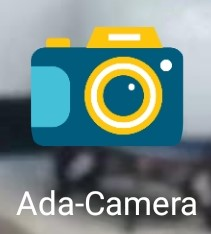

### Ada_Camera：自适应人脸定位的拍照应用程序

#### 应用

#### app效果

<video id="video" controls=""src="https://github.com/Rick0514/Camera-Car/blob/master/adacam.mp4" preload="none">

#### 搭载在硬件上效果
<video id="video" controls=""src="https://github.com/Rick0514/Camera-Car/blob/master/car.mp4" preload="none">

#### 在此感谢以下开源库的支持

* [@zzhoujay](https://github.com/zzhoujay/RichText) Android平台上的富文本解析器
* [@Jasonchenlijian](https://github.com/Jasonchenlijian/FastBle) Android低功耗蓝牙开源库
           
#### 以及所有博客以及书籍的帮助，以下是主要博客
* [@涛声依旧Cjt](https://blog.csdn.net/u010898329/article/details/82424273) 
* [@Smashing](https://www.jianshu.com/p/331af6dc2772) 
* 《第一行代码：Android》
* b站 **天哥在奔跑** 系列安卓教学视频
        
 #### 硬件依赖

- [x] 安卓6.0++（最好）
- [x]  BLE蓝牙模块
- [x] 支持Usart串口通信的单片机
            

#### 简要功能说明

连接蓝牙后，可以进入摄像头操作，后置摄像头捕获环境中的人脸，并返回与最佳拍照位置人脸的偏差，把偏差数据通过**Writenoresponse**方式发送给蓝牙。单片机通过决策，可以通过**Notify**方式通知上位机，进行拍照保存。
         
#### 使用说明
* 点击 **扫描** 按键后，手机动态申请蓝牙和位置权限，请放心授权，否则程序会强制退出。\n" +
扫描后出现所需蓝牙最好按下 **停止** 按键停止扫描后再进入相机操作。\n" +
人脸识别速度与手机硬件有关，适合低速场景，如果告诉移动手机将得不到良好效果。\n" +
           

#### 联系方式 

后续会发布具体使用博客，请关注：[@gy_rick](https://me.csdn.net/blog/gy_Rick)
或通过邮件私信哦：gy_rick@foxmail.com
拍照小车硬件实现可私信：zl_keepmoving@163.com"

